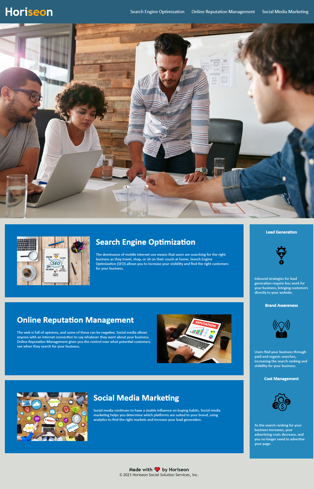

# Horiseon Marketing Webpage Accessibilty Update

## Description

The Horiseon marketing comapny requested a website that meets accessibility standards.  This projet brings their site up to date by using semantic html elements and alterante attributes where possible.  The code used in both the html document and css stylesheet has been greatly reduced throughout the course of this project.  The updates to the company's website will enhance the accessibility standards and increase search engine optimization.

## Website URL

https://chilejay7.github.io/01-marketing-accessibility/

## Usage

A screenshot of the updated webiste design is included below for reference.

## Credits

N/A

## License

Please refer to the LICENSE in the repo.